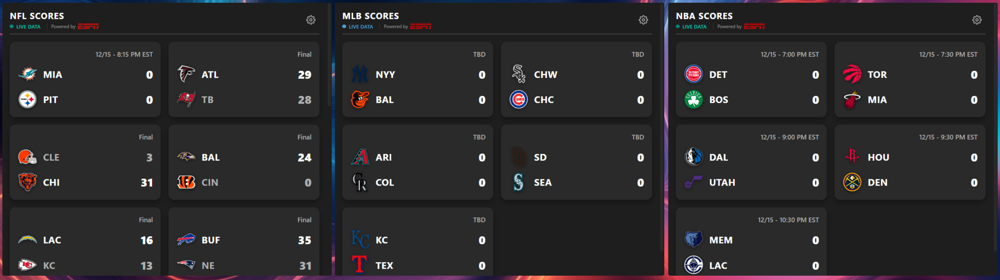
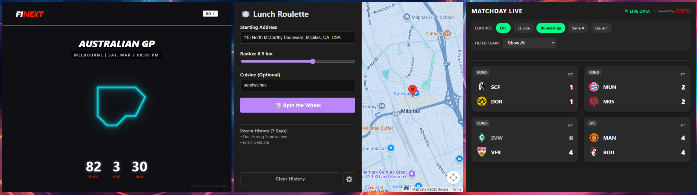
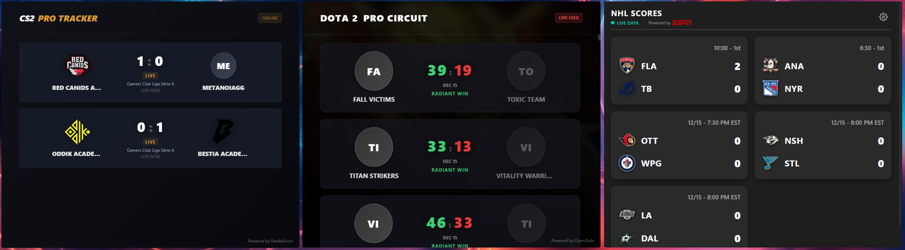
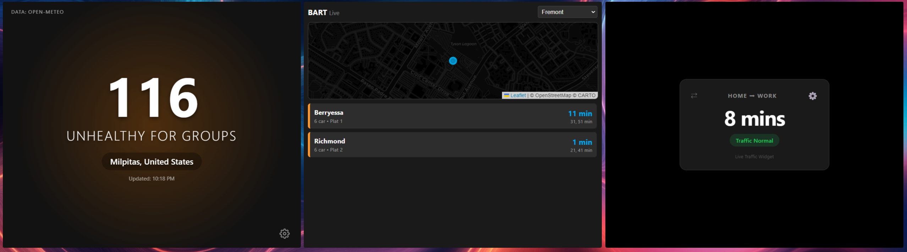
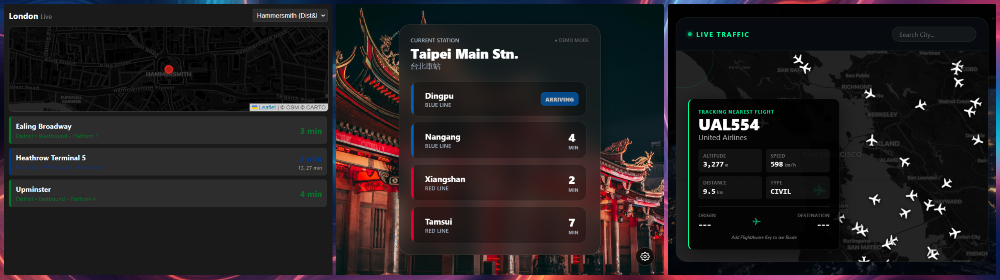

-----------------------------------------------------------------------

I'm shocksim, one of the creators of the Xeneon Edge LCD display at Corsair. I was bored one day and decided to make some example iframe widgets and share them.

These are formatted iframe widgets that you can copy and paste into the "code" form in the IFRAME widget in iCUE. These then use HTML/JS/CSS to draw a webpage and dynamically pull whatever data from a web api somewhere. If there are no public APIs, there'll be a note in the code to tell you how to go sign up for an account to get your own free api key. These APIs are usually free for personal use but costs money to call APIs at scale so they require an account. 

Feel free to take the code, fork it, play around with modifying it and using the widgets. Happy Holidays!

For CS2: Sign up for a Pandascore account for their free API and you could create widgets for other games they service. You have to edit your API into the code.

For Lunch Roulette: Sign up for a free Google Cloud account to tap into 'Places & Places (New) API's enabled, as well as the 'Maps Javascript API'. These will take at least 1-2mins to propogate once you've enabled them. You have to edit your API into the code.

For Live Commute Timer: You need a Google Cloud API key that has the 'Distance Matrix API' enabled. This one has a setup form so you don't have to edit the code.

Live Flight viewer requires a FlightAware API key if you want to see origin/destination.

The rest of them shouldn't require any extra API keys.

