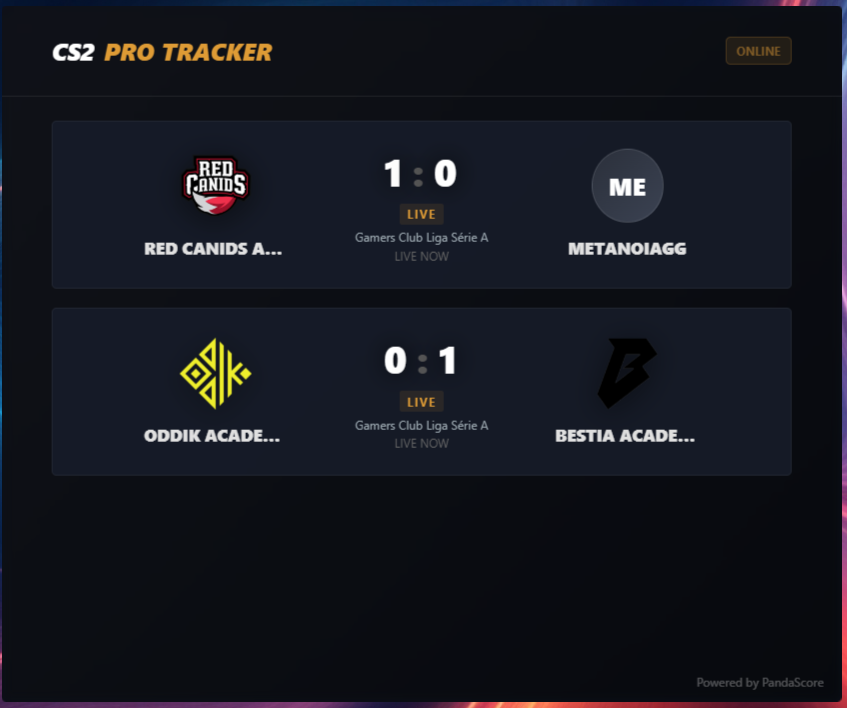
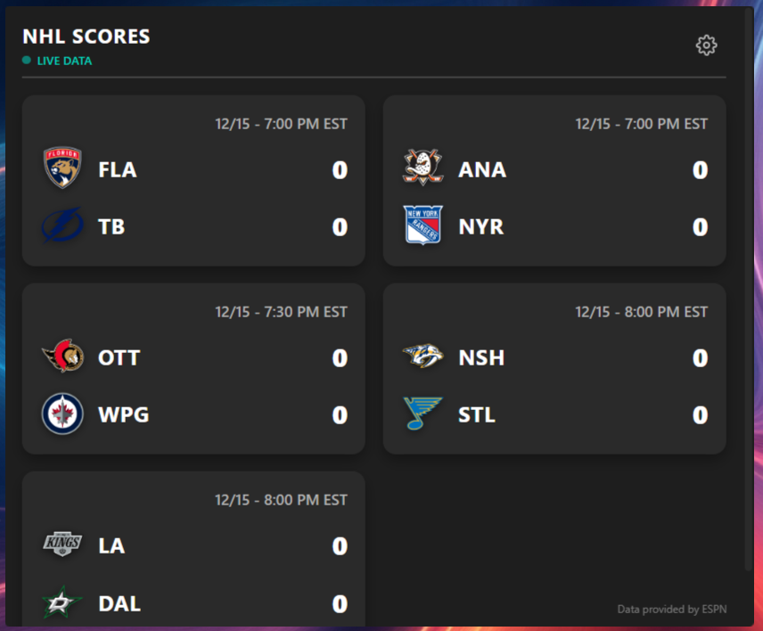
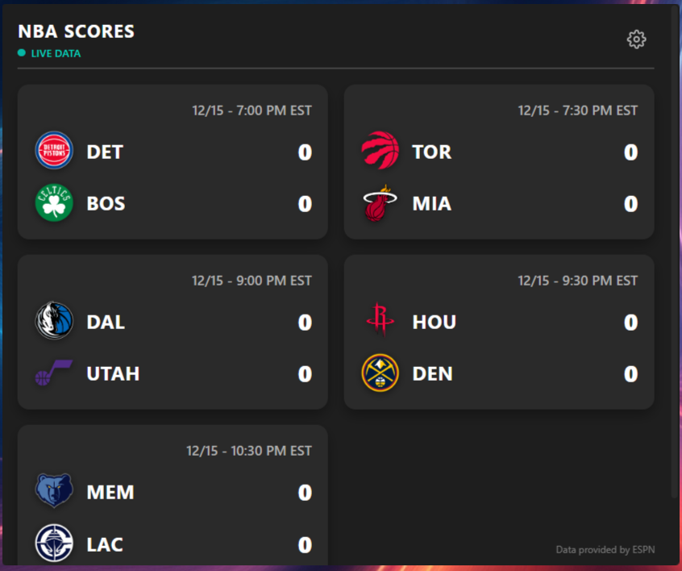
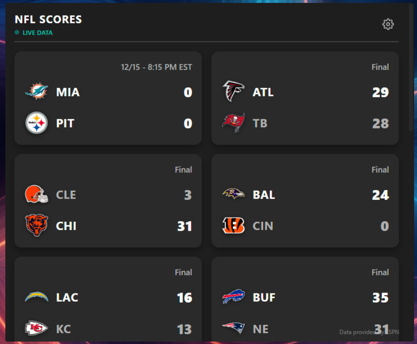

I'm shocksim, one of the people in working on the Xeneon Edge project at Corsair. I was bored one day and decided to make some example iframe widgets and share them.

These are formatted iframe HTML widgets that you can copy and paste into the "code" form in the IFRAME widget in iCUE. These then use HTML/JS/CSS to draw a webpage and dynamically pull whatever data from a web api somewhere. If there are no public APIs, there'll be a note in the code to tell you how to go sign up for your own personal/free api. 

Feel free to take the code and fork it, play around with modifying it and using the widgets. Happy Holidays!

For CS2: Sign up for a Pandascore account for their free API. 

For Lunch Roulette: Sign up for a free Google Cloud account to tap into Maps/Places APIs.

Counter-Strike 2 eSports Tracker

Lunch Roulette

NHL Scores

NBA Scores

NFL Scores

Pro Football (Soccer) Scores

Formula 1 Next Race Tracker

DOTA2 Esports Tracker

